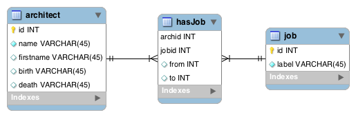
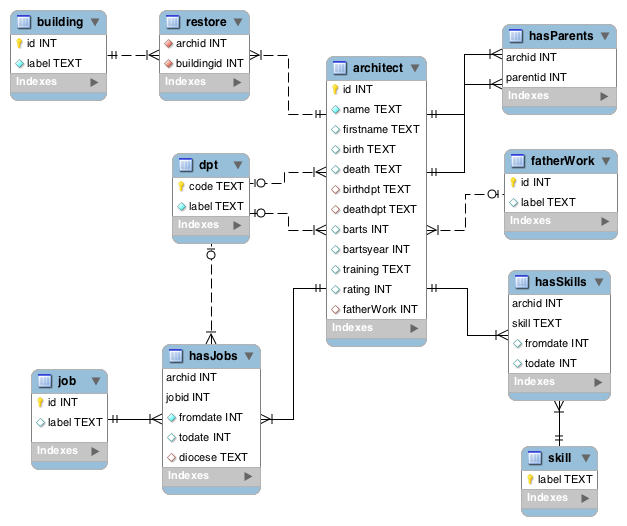

Base de données relationnelle
===
introduction avec [SQLite](https://www.sqlite.org/index.html)

# Introduction
## Objectifs
* Comprendre les principaux concepts.
* Cerner les principaux écueils de la modélisation.
* Définir le schéma de sa première base.

## Une base prosopographique ; un mail d’Olivier…
> “À partir de [notices](http://elec.enc.sorbonne.fr/architectes/), nous déterminerons une liste de champs (...) :
> * `name` : patronyme (unique, obligatoire)
> * `firstname` : prénom (unique)
> * `birth` : date de naissance (unique)
> * `death` : date de mort (unique)
> * `job` : fonction (i.e. architecte|inspecteur|suppléant|honoraire) (unique ici)
> * `from` : date de prise de fonction (unique)
> * `to` : date de fin de fonction (unique)
> * ...”

Comment enregistrer ces "champs" pour les architectes suivants ?  
[Paul ABADIE](http://elec.enc.sorbonne.fr/architectes/1), [Albert BÉZIERS-LAFOSSE](http://elec.enc.sorbonne.fr/architectes/57), [Eugène Millet](http://elec.enc.sorbonne.fr/architectes/373) et [François Léonce REYNAUD](http://elec.enc.sorbonne.fr/architectes/432).

# Une première base

## Le tableur
|name|firstname|birth|death|job|from|to|
|----|---------|-----|-----|---|----|--|
|Abadie|Paul (fils)|1812-12-10|1884-08-12|architecte|1881|1884|
|Abadie|Paul (fils)|1812-12-10|1884-08-12|inspecteur|1872|1884|
|Béziers-Lafosse|Albert|1840|1908-09-14|inspecteur|1881|1905|
|Millet|Eugène|1819-05-21|1879-02-24|architecte|1848|1875|
|Millet|Eugène|1819-05-21|1879-02-24|inspecteur|1875|1879|
|Reynaud|François Léonce|1803|1880|inspecteur|1853|1856|

## Problèmes ?

**Insertion**
* Unicité : comment empêcher de représenter plusieurs fois le même architecte ?
* Intégrité : un architecte peut apparaître plusieurs fois et décrit de différentes
manières (`birth`, `death`).

**Modification**
* Maintenir la cohérence des données : si je modifie la date de naissance pour le premier enregistrement "Millet" (architecte), comment garantir le report de l’information le second enregistrement "Millet" (inspecteur) ?

**Suppression**
* Perte d’information : on ne peut pas supprimer une mission sans supprimer l’architecte.

## Restructuration 1 (clé étrangère)

On (re)structure les tables pour éviter les redondances.  
On peut représenter séparément les architectes et leur(s) mission(s).

### Table `architect`
|id|name|firstname|birth|death|
|--|----|---------|-----|-----|
|1|Abadie|Paul (fils)|1812-12-10|1884-08-12|
|2|Béziers-Lafosse|Albert|1840|1908-09-14|
|3|Millet|Eugène|1819-05-21|1879-02-24|
|4|Reynaud|François Léonce|1803|1880|

### Table de relation `mission`
|archid|mission|from|to|
|------|-------|----|--|
|1|architecte|1881|1884|
|1|inspecteur|1872|1884|
|2|inspecteur|1881|1905|
|3|architecte|1848|1875|
|3|inspecteur|1875|1879|
|4|inspecteur|1853|1856|

### Vocabulaire
* **entité**
* **attribut** : propriété d’une entité…
* **table**
* **enregistrement**
* **clé primaire** : attribut qui identifie un enregistrement
* **clé étrangère** : attribut qui référence une donnée connexe.  
La clé primaire identifiant un architecte (`id`) est déportée dans la table `mission` (`archid`) sous la forme d’une clé étrangère.

### Problème
La nomenclature des mission (architecte, inspecteur, etc.) peut changer.  
Une mission peut être définie dans la base dans un attribut dédié (par ex. `mission.definition`).  
Comment contrôler plus finement cette liste d’autorité ?

## Restructuration 2 (association)

### Modèle conceptuel
**Association.** Une association est une liaison qui a une signification précise entre plusieurs **entités**.  
> *Un architecte **réalise** une mission*.

**Cardinalité.** C’est le nombre d’occurrences, minimal et maximal – exprimé sous la forme d’un couple (card. min, card. max) –, d’une association par rapport à chaque occurrence d’une entité donnée.  
D’une entité donnée vers une association donnée :
* La cardinalité minimale peut être 0 ou 1.
* La cardinalité maximale peut être 1 ou n.

Une cardinalité minimale de 1 doit se justifier par le fait que les individus de l'entité en question ont besoin de l'association pour exister. Dans tous les autres cas, la cardinalité minimale vaut 0.

> *Un architecte réalise **0 à n** mission(s).*  
> *Une mission est réalisée par **1 à n** architecte(s).*

**MCD.** On peut représenter cette association et sa cardinalité sous la forme d’un schéma. C’est le **modèle conceptuel de données** (MCD).

> `architecte`(0,n)-----`réalise`------(1,n)`mission`  
> `architect`(0,n)-----`hasJob`------(1,n)`job`

**Le choix des cardinalité est ESSENTIEL (moment décisif). Moment délicat de la modélisation.**

### Modèle relationnel (MRD)

### Table `architect`
|id|name|firstname|birth|death|
|--|----|---------|-----|-----|
|1|Abadie|Paul (fils)|1812-12-10|1884-08-12|
|2|Béziers-Lafosse|Albert|1840|1908-09-14|
|3|Millet|Eugène|1819-05-21|1879-02-24|
|4|Reynaud|François Léonce|1803|1880|

### Table `job`
|id|label|definition?|
|--|-----|-----------|
|1|architecte||
|2|inspecteur|||

### Table d’association `hasJob`
|archid|jobid|from|to|
|------|-----|----|--|
|1|1|1881|1884|
|1|2|1872|1884|
|2|2|1881|1905|
|3|1|1848|1875|
|3|2|1875|1879|
|4|2|1853|1856|

Les dates (`from` et `to`) sont des **attributs de l’association** `hasJob`.

# Des notices à la base. Définition du schéma de la base `architectes`
> Dans les notices d’architectes, vous avez relevé les informations suivantes :
> * `name`: nom
> * `firstname`: prénom
> * `birth`: date de naissance
> * `death`: date de mort
> * `birthdpt`: département de naissance
> * `deathdpt`: lieu de mort
> * `barts`: formation aux beaux-arts
> * `bartsyear`: année de promotion aux beaux-arts
> * `training`: autre(s) formation(s)
> * `skill`: domaine(s) de compétence (cathédrale|séminaire|églises|tout)
> * `rating`: appréciation de la hiérarchie en 1853
> * `fatherWork`: milieu professionnel du père
> * `hasParent`: parenté avec un autre membre de la base
> * poste(s) d’architecte diocésain
>   * `job`: attributions (architecte|inspecteur|suppléant|honoraire)
>   * `fromdate`: date de début (unique)
>   * `todate`: date de fin (unique)
>   * `docese`: diocèse (unique)
> * chantier(s): `building` et `restore`
>
> **Exercice**
> 1. Définir les **entités** de notre base prosopographique.
> 1. Définir les **associations** entre ces entités.
> 1. Placer les **attributs** listés ci-dessus dans le schéma entités associations.
> 1. Définir le **type** ([voir la doc](http://www.sqlite.org/datatype3.html#section_2_2)) de ces attributs ?
> 1. Définir les **clés primaires**.
> 1. Définir les **cardinalité** (0,1) à (1,n).
> 1. Définir les **#clés étrangères**.

## Diagramme du modèle relationnel

